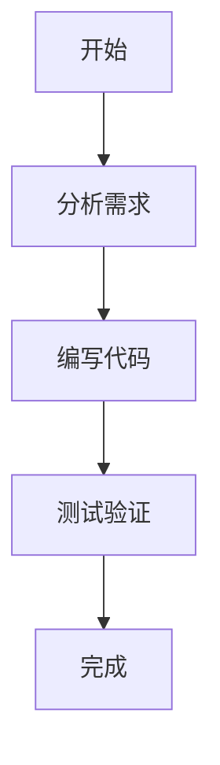

# 打卡数据处理（Qt6 桌面工具）

本项目用于解析员工打卡Excel原表（每3行为一人），支持多工作表合并、时间规范化、AM/NOON有效窗口判定、逐人逐日聚合与汇总导出（xlsx与UTF-8 BOM的csv），并提供需要打卡日的选择与口径页导出。

## 运行环境
- Python：建议使用Anaconda虚拟环境 `C:/Users/stan/.conda/envs/use/python.exe`
- 终端：PowerShell
- 依赖：见 `requirements.txt`

## 终端UTF-8配置（避免中文乱码）
```
pwsh.exe -NoLogo -NoProfile -Command $ErrorActionPreference='Stop';
[Console]::InputEncoding = [Console]::OutputEncoding = New-Object System.Text.UTF8Encoding $false;
$env:PYTHONIOENCODING = 'utf-8';
$PSDefaultParameterValues['Out-File:Encoding'] = 'utf8';
'OK: UTF-8 configured'
```

## 安装依赖
```
"C:/Users/stan/.conda/envs/use/python.exe" -m pip install -r requirements.txt
```

## 启动桌面程序
```
"C:/Users/stan/.conda/envs/use/python.exe" main_dakaprocess.py
```

## 起始行自动探测
- 默认`数据起始行=1`表示自动探测，会从整张表中扫描`姓名→日期→时刻`模式；仅当特殊场景需要限制搜索范围时，可将其设置为>1的行号。

## 自检（无界面示例验证与导出）
```
"C:/Users/stan/.conda/envs/use/python.exe" selfcheck.py
```

## 流程图（Mermaid）


## 功能摘要
- 选择多个Excel文件，支持多工作表合并
- 解析三行结构：
  - 第1行：优先匹配“姓名：XXX”；否则取“姓名”右侧第一个非空格
  - 第2行：日期1–31
  - 第3行：对应日期的多个打卡时刻，支持空格/逗号/分号/斜杠/换行分隔
- 时间标准化：支持 H:MM[:SS]、HH:MM[:SS]、HMM/HHMM（如0835→08:35:00）
- 有效窗口（逐条记录）：
  - AM：<=09:04:59
  - NOON：11:00:00–14:04:59
  - 同日同窗多次只计1次；每日最多2次（AM+NOON）
- 需要打卡日：选择年份+月份，并在31个勾选框内选休息日；需要打卡日=当月天数-休息日；应打卡次数=2*需要打卡日
- 汇总口径（核心差额法）：
  - 打卡天数：当月需要打卡日内，打过卡的天数（任一窗命中即记1天）
  - 打卡次数：当月有效打卡次数（去重后，最多2/日）
  - 缺勤天数=需要打卡日-打卡天数（仅0次日）
  - 缺勤次数=应打卡次数-打卡次数（包含只打一窗的缺1次）
  - 缺勤具体日期：仅列0次的那些需要打卡日
- 导出：
  - 汇总表（xlsx + UTF-8 BOM的csv）
  - 可选明细（含AM/NOON标记）
  - “需要打卡日”口径页
